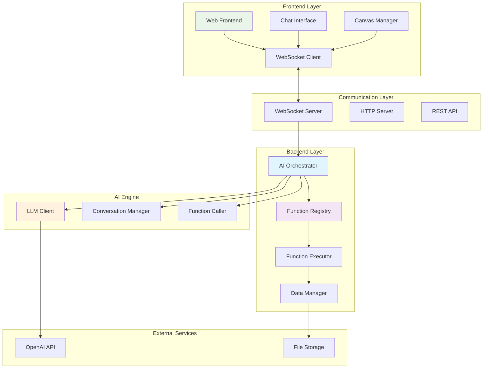
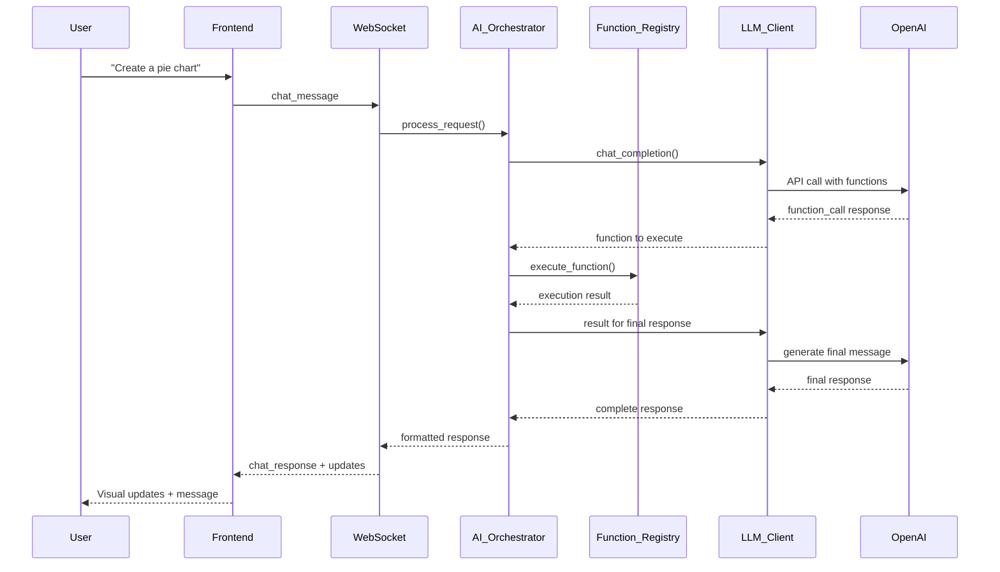
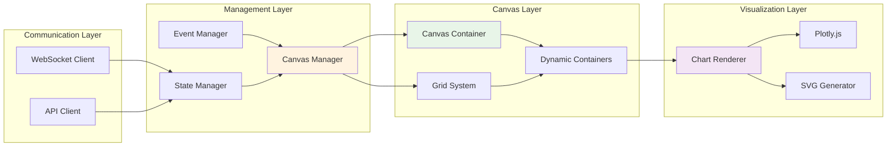
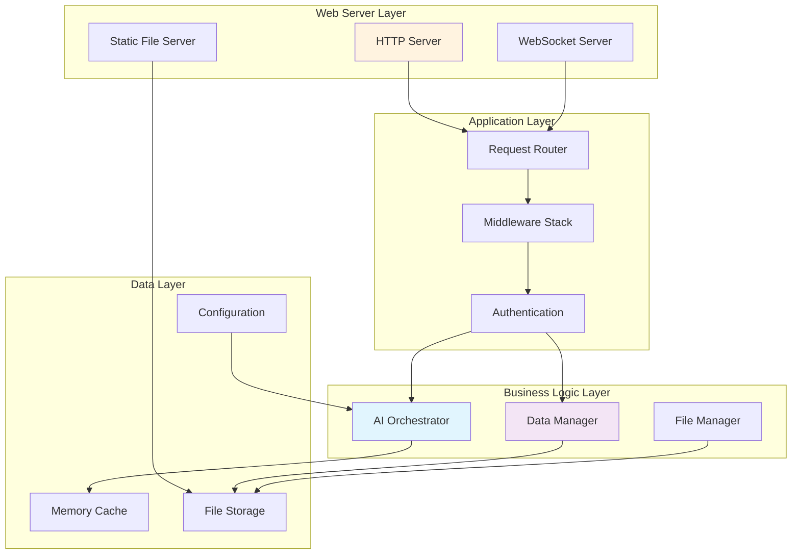
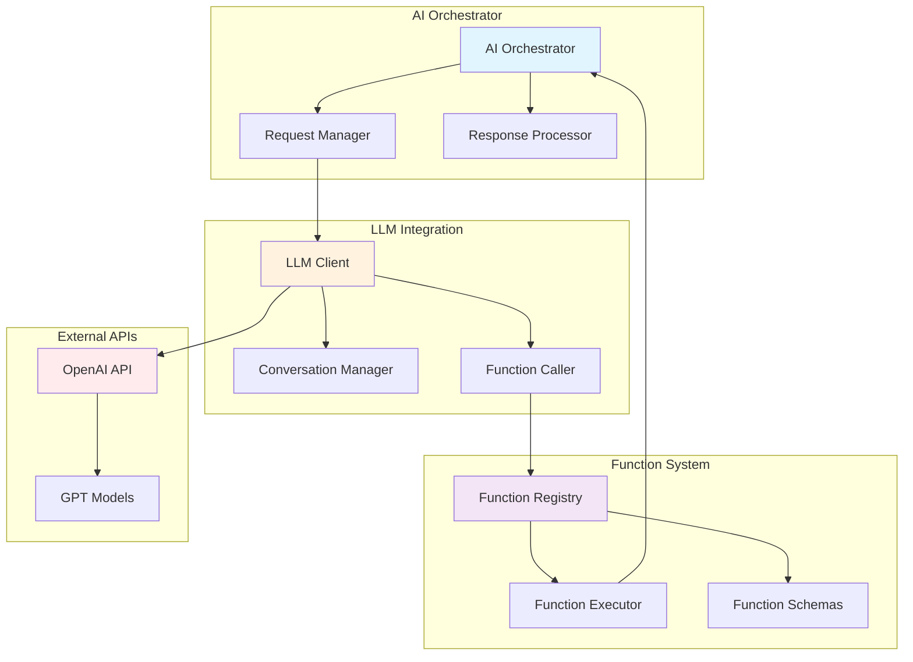
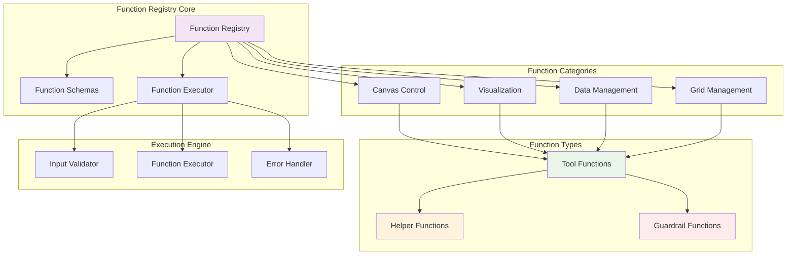
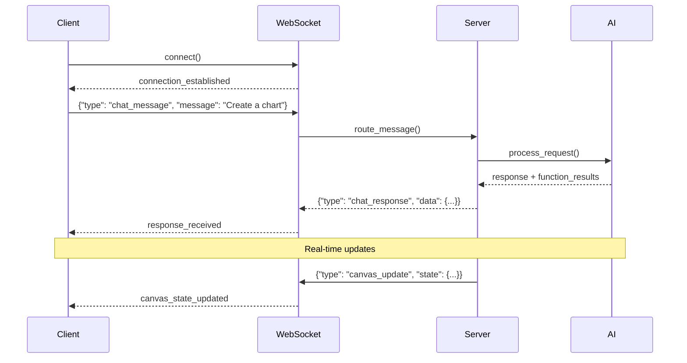
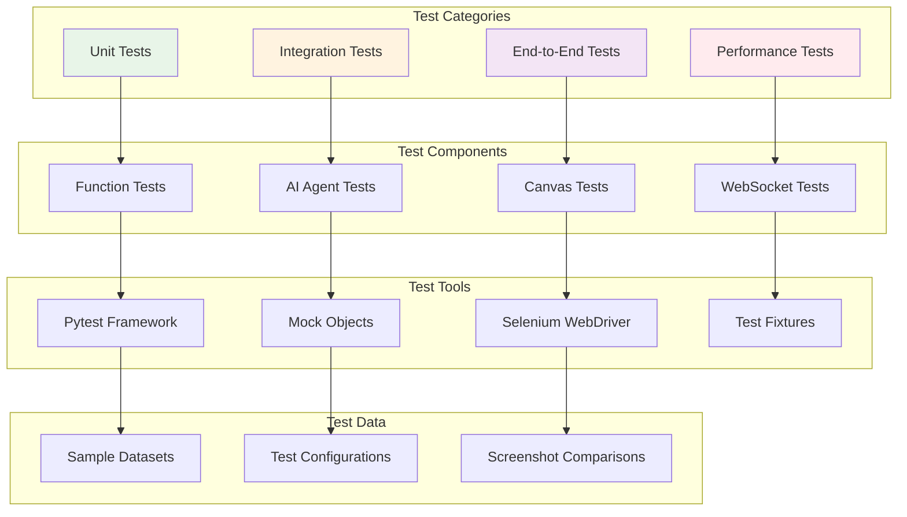
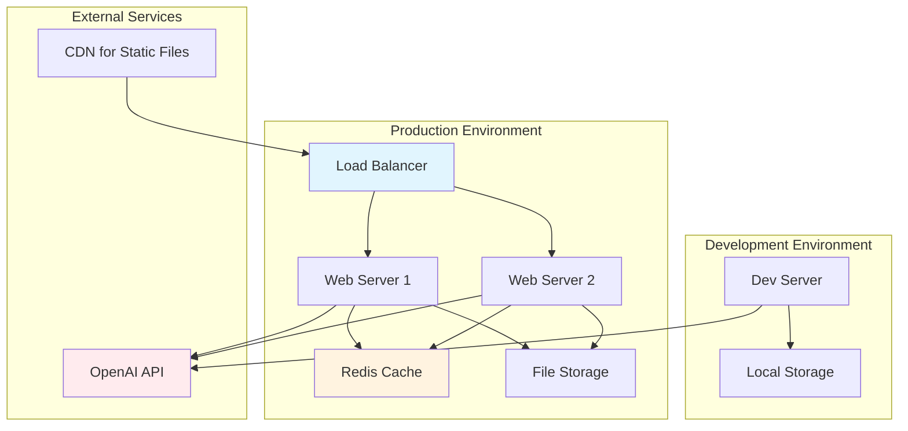

# AI Data Analyst Infrastructure Documentation v0.1

## 🎯 Overview

This document describes the complete infrastructure of the AI Data Analyst system, a modular architecture that enables natural language control of data visualization canvases through AI agents and function calling.

## 📋 Table of Contents

1. [System Architecture](#system-architecture)
2. [Frontend Infrastructure](#frontend-infrastructure)
3. [Backend Infrastructure](#backend-infrastructure)
4. [AI Agent System](#ai-agent-system)
5. [Function Registry](#function-registry)
6. [Communication Layer](#communication-layer)
7. [Testing Infrastructure](#testing-infrastructure)
8. [Deployment & Configuration](#deployment--configuration)

---

## System Architecture

### High-Level Architecture



### Component Interaction Flow



---

## Frontend Infrastructure

### Canvas System Architecture



### Frontend Components

#### 1. Canvas Container System
- **Purpose**: Dynamic container management on a flexible canvas
- **Technology**: HTML5 Canvas with absolute positioning
- **Features**:
  - Drag & drop container placement
  - Resize handles for containers
  - Grid snapping and alignment
  - Collision detection and overlap prevention
  - Responsive design for different screen sizes

#### 2. Canvas Manager (`canvas-manager.js`)
```javascript
class CanvasManager {
    constructor(canvasElement) {
        this.canvas = canvasElement;
        this.containers = new Map();
        this.settings = {
            width: 800,
            height: 600,
            autoAdjust: true,
            overlapPrevention: true
        };
    }
    
    // Core container operations
    createContainer(id, x, y, width, height) { }
    deleteContainer(id) { }
    modifyContainer(id, properties) { }
    
    // Canvas operations
    getCanvasState() { }
    clearCanvas() { }
    resizeCanvas(width, height) { }
    
    // Event handling
    setupEventListeners() { }
    handleContainerEvents() { }
}
```

#### 3. Chat Interface (`chat-interface.js`)
- **Purpose**: Natural language interaction with AI
- **Features**:
  - Real-time message display
  - Typing indicators
  - Message history
  - Auto-scroll and formatting
  - Error handling and retry mechanisms

#### 4. WebSocket Client (`websocket-client.js`)
- **Purpose**: Real-time communication with backend
- **Protocol**: WebSocket with JSON message format
- **Message Types**:
  - `chat_message`: User input to AI
  - `chat_response`: AI responses
  - `canvas_update`: Canvas state changes
  - `function_result`: Function execution results
  - `error`: Error notifications

### Frontend File Structure
```
ui/web_frontend/
├── index.html                 # Main application entry point
├── css/
│   ├── styles.css            # Main stylesheet with purple theme
│   ├── canvas.css            # Canvas-specific styles
│   └── chat.css              # Chat interface styles
└── js/
    ├── app.js                # Application initialization
    ├── canvas-manager.js     # Canvas and container management
    ├── chat-interface.js     # Chat UI and message handling
    ├── websocket-client.js   # Real-time communication
    ├── chart-renderer.js     # Visualization rendering
    └── utils.js              # Utility functions
```

---

## Backend Infrastructure

### Core Backend Architecture



### Backend Components

#### 1. Main Server (`main.py`)
- **Framework**: Python with asyncio and WebSockets
- **Purpose**: HTTP and WebSocket server coordination
- **Features**:
  - Static file serving for frontend
  - WebSocket connection management
  - Request routing and middleware
  - Error handling and logging

#### 2. WebSocket Adapter (`adapters/web_adapter/`)
- **Purpose**: Bridge between WebSocket and AI engine
- **Features**:
  - Message parsing and validation
  - Session management
  - Real-time response streaming
  - Connection state management

#### 3. Data Manager
- **Purpose**: Data state and file management
- **Features**:
  - Dataset loading and caching
  - File upload and processing
  - Data transformation pipelines
  - Memory management

---

## AI Agent System

### AI Engine Architecture



### AI Components

#### 1. AI Orchestrator (`core/ai_engine/ai_orchestrator.py`)
```python
class AIOrchestrator:
    def __init__(self, function_registry, llm_client):
        self.function_registry = function_registry
        self.llm_client = llm_client
        self.conversation_manager = ConversationManager()
        self.function_caller = FunctionCaller(function_registry)
    
    async def process_request(self, user_message, session_id):
        # Add message to conversation
        conversation = self.conversation_manager.get_conversation(session_id)
        conversation.add_user_message(user_message)
        
        # Get LLM response with function calling
        response = await self.llm_client.chat_completion(
            messages=conversation.get_messages(),
            functions=self.function_registry.get_schemas()
        )
        
        # Process function calls if any
        if response.has_function_calls():
            results = await self.function_caller.execute_calls(
                response.function_calls
            )
            # Get final response with function results
            final_response = await self.llm_client.process_function_results(
                conversation, results
            )
            return final_response
        
        return response
```

#### 2. LLM Client (`core/ai_engine/llm_client.py`)
- **Purpose**: Direct integration with OpenAI API
- **Features**:
  - API key management and rotation
  - Model selection (GPT-3.5, GPT-4, etc.)
  - Token usage tracking and optimization
  - Error handling and retries
  - Rate limiting and backoff

#### 3. Conversation Manager (`core/ai_engine/conversation_manager.py`)
- **Purpose**: Chat history and context management
- **Features**:
  - Multi-session conversation tracking
  - Context window management
  - Message persistence
  - Memory optimization
  - Conversation summarization

#### 4. Function Caller (`core/ai_engine/function_caller.py`)
- **Purpose**: Function calling workflow orchestration
- **Features**:
  - Function call detection and parsing
  - Argument validation
  - Parallel function execution
  - Result aggregation
  - Error handling and recovery

---

## Function Registry

### Function Registry Architecture



### Function Classification System

Based on the [Function Classification Guide](tests/FUNCTION_CLASSIFICATION_GUIDE.md), functions are organized into three distinct classes:

#### 1. Tool Functions (LLM-Accessible)
**Purpose**: Functions directly accessible to the LLM for executing user requests

**Examples**:
```python
# Canvas Control Tools
create_container(container_id: str) -> Dict[str, Any]
delete_container(container_id: str) -> Dict[str, Any]
modify_container(container_id: str) -> Dict[str, Any]
get_canvas_state() -> Dict[str, Any]
clear_canvas() -> Dict[str, Any]

# Visualization Tools
create_pie_chart(container_id: str, title: str, use_sample_data: bool) -> Dict[str, Any]
create_bar_chart(container_id: str, data: Dict, x_col: str, y_col: str) -> Dict[str, Any]

# Canvas Management Tools
take_screenshot(filename: str = None) -> Dict[str, Any]
get_canvas_size() -> Dict[str, Any]
edit_canvas_size(width: int, height: int) -> Dict[str, Any]
```

#### 2. Helper Functions (Internal Support)
**Purpose**: Internal utility functions used by tool functions

**Examples**:
```python
# Layout Optimization Helpers
_calculate_optimal_container_layout(containers, canvas_width, canvas_height)
_get_all_containers_for_optimization(new_container_id, exclude_container_id)
_apply_optimized_layout(optimization_result, target_container_id)

# Content Generation Helpers
_create_pie_chart_html(title, labels, values)
_refresh_pie_chart_in_container(container_id)

# Data Processing Helpers
_get_all_used_identifiers()
_generate_alternative_identifiers(base_id, used_ids)
```

#### 3. Guardrail Functions (Safety & Validation)
**Purpose**: Functions that enforce safety rules and prevent unsafe operations

**Examples**:
```python
# Input Validation Guardrails
_validate_identifier_uniqueness(proposed_id, element_type)
_validate_container_bounds(x, y, width, height, canvas_width, canvas_height)
_validate_chart_data(labels, values)

# Safety Enforcement Guardrails
_enforce_container_bounds(container_element)
_prevent_overlap_conflicts(new_container, existing_containers)
_sanitize_html_content(html_content)
```

### Function Registry Implementation

#### Core Registry (`core/function_registry/function_registry.py`)
```python
class FunctionRegistry:
    def __init__(self):
        self.functions = {}
        self.schemas = []
        self.categories = {
            'canvas_control': [],
            'visualization': [],
            'data_management': [],
            'grid_management': []
        }
    
    def register_function(self, name, func, schema, category):
        """Register a function with its schema and category"""
        self.functions[name] = func
        self.schemas.append(schema)
        self.categories[category].append(name)
    
    def get_function(self, name):
        """Get a function by name"""
        return self.functions.get(name)
    
    def get_schemas(self):
        """Get all function schemas for LLM"""
        return self.schemas
    
    def get_category_functions(self, category):
        """Get functions by category"""
        return self.categories.get(category, [])
```

#### Function Executor (`core/function_registry/function_executor.py`)
```python
class FunctionExecutor:
    def __init__(self, function_registry):
        self.registry = function_registry
        self.validators = {}
        self.guardrails = {}
    
    async def execute_function_call(self, function_name, arguments):
        """Execute a function call with validation and guardrails"""
        try:
            # 1. Validate function exists
            func = self.registry.get_function(function_name)
            if not func:
                return self._error_response(f"Function {function_name} not found")
            
            # 2. Apply input validation guardrails
            validation_result = await self._validate_inputs(function_name, arguments)
            if not validation_result.is_valid:
                return self._error_response(validation_result.error)
            
            # 3. Execute the function
            result = await func(**arguments)
            
            # 4. Apply output guardrails
            processed_result = await self._apply_output_guardrails(function_name, result)
            
            return processed_result
            
        except Exception as e:
            return self._error_response(f"Execution error: {str(e)}")
    
    def _error_response(self, error_message):
        return {
            "status": "error",
            "error": error_message,
            "timestamp": datetime.now().isoformat()
        }
```

### Function Schema Format

All functions follow OpenAI's function calling schema format:

```python
FUNCTION_SCHEMA_TEMPLATE = {
    "name": "function_name",
    "description": "Clear description of what the function does",
    "parameters": {
        "type": "object",
        "properties": {
            "param_name": {
                "type": "string|number|boolean|array|object",
                "description": "Parameter description",
                "enum": ["option1", "option2"],  # Optional
                "default": "default_value"        # Optional
            }
        },
        "required": ["required_param1", "required_param2"]
    }
}
```

**Example Schema**:
```python
CREATE_CONTAINER_SCHEMA = {
    "name": "create_container",
    "description": "Create a new container on the canvas using automatic optimal layout",
    "parameters": {
        "type": "object",
        "properties": {
            "container_id": {
                "type": "string",
                "description": "Unique identifier for the container"
            }
        },
        "required": ["container_id"]
    }
}
```

---

## Communication Layer

### WebSocket Protocol



### Message Format

#### Client to Server Messages
```json
{
    "type": "chat_message",
    "message": "Create a pie chart in container 'sales'",
    "session_id": "user_123",
    "timestamp": "2024-01-01T12:00:00Z"
}
```

#### Server to Client Messages
```json
{
    "type": "chat_response",
    "message": "I've created a pie chart in the sales container.",
    "function_results": [
        {
            "function_name": "create_pie_chart",
            "status": "success",
            "result": {...}
        }
    ],
    "canvas_updates": {
        "containers": [...],
        "state": {...}
    },
    "timestamp": "2024-01-01T12:00:01Z"
}
```

### WebSocket Server Implementation

```python
class WebSocketServer:
    def __init__(self, ai_orchestrator):
        self.ai_orchestrator = ai_orchestrator
        self.connections = {}
    
    async def handle_connection(self, websocket, path):
        """Handle new WebSocket connection"""
        session_id = self.generate_session_id()
        self.connections[session_id] = websocket
        
        try:
            await self.send_welcome_message(websocket)
            async for message in websocket:
                await self.handle_message(session_id, message)
        except websockets.exceptions.ConnectionClosed:
            pass
        finally:
            del self.connections[session_id]
    
    async def handle_message(self, session_id, message):
        """Process incoming message"""
        try:
            data = json.loads(message)
            
            if data["type"] == "chat_message":
                response = await self.ai_orchestrator.process_request(
                    data["message"], session_id
                )
                await self.send_response(session_id, response)
                
        except Exception as e:
            await self.send_error(session_id, str(e))
```

---

## Testing Infrastructure

### Test Architecture



### Test Structure

```
tests/
├── frontend/                    # Frontend-specific tests
│   ├── index.html              # Test canvas interface
│   └── test_canvas_ui.py       # UI interaction tests
├── python/                     # Backend Python tests
│   ├── canvas_controller.py    # Canvas control interface
│   ├── llm_canvas_chatbot.py   # AI chatbot implementation
│   ├── test_*.py              # Individual test files
│   ├── screenshots/           # Test screenshots
│   └── requirements.txt       # Test dependencies
└── README.md                  # Test documentation
```

### Key Test Files

#### 1. Canvas Controller Tests
```python
# tests/python/test_canvas_controller.py
def test_container_creation():
    controller = CanvasController(headless=True)
    result = controller.create_container("test", 100, 100, 200, 150)
    assert result == True
    
    state = controller.get_current_state()
    assert len(state['containers']) == 1
    assert state['containers'][0]['id'] == "test"
```

#### 2. Function Registry Tests
```python
# tests/python/test_function_registry.py
def test_function_execution():
    executor = FunctionExecutor(AVAILABLE_FUNCTIONS, FUNCTION_SCHEMAS)
    result = executor.execute_function_call(
        "create_container", 
        {"container_id": "test_container"}
    )
    assert result["status"] == "success"
```

#### 3. AI Agent Tests
```python
# tests/python/test_ai_agent.py
@pytest.mark.asyncio
async def test_ai_function_calling():
    chatbot = CanvasChatbot(headless=True)
    chatbot.initialize()
    
    response = chatbot.process_user_message(
        "Create a container called 'test_chart'"
    )
    assert "successfully" in response.lower()
```

### Test Execution

#### Running All Tests
```bash
# Backend tests
cd tests/python
python -m pytest test_*.py -v

# Frontend tests (requires browser)
python test_canvas_ui.py

# Integration tests
python test_integration.py
```

#### Test Categories

1. **Unit Tests**: Individual function testing
2. **Integration Tests**: Component interaction testing
3. **End-to-End Tests**: Full workflow testing
4. **Performance Tests**: Load and stress testing

---

## Deployment & Configuration

### Environment Configuration

#### Required Environment Variables
```bash
# OpenAI Configuration
OPENAI_API_KEY=your_openai_api_key_here
OPENAI_MODEL=gpt-4o-mini
MAX_TOKENS=1000

# Server Configuration
HOST=localhost
PORT=8000
DEBUG=true

# Canvas Configuration
CANVAS_WIDTH=800
CANVAS_HEIGHT=600
AUTO_ADJUST=true
OVERLAP_PREVENTION=false
```

#### Configuration Files

**`.env` File**:
```env
OPENAI_API_KEY=sk-...
OPENAI_MODEL=gpt-4o-mini
HOST=0.0.0.0
PORT=8000
DEBUG=false
```

**`config.json`**:
```json
{
    "canvas": {
        "default_width": 800,
        "default_height": 600,
        "max_containers": 50,
        "auto_adjust": true,
        "overlap_prevention": false
    },
    "ai": {
        "model": "gpt-4o-mini",
        "max_tokens": 1000,
        "temperature": 0.3,
        "max_function_calls": 5
    },
    "server": {
        "host": "localhost",
        "port": 8000,
        "cors_origins": ["*"],
        "websocket_timeout": 300
    }
}
```

### Deployment Architecture



### Installation & Setup

#### 1. Clone Repository
```bash
git clone https://github.com/your-org/ai-data-analyst.git
cd ai-data-analyst
```

#### 2. Install Dependencies
```bash
# Backend dependencies
pip install -r requirements.txt

# Test dependencies
pip install -r tests/python/requirements.txt
```

#### 3. Configure Environment
```bash
# Copy environment template
cp .env.example .env

# Edit configuration
nano .env
```

#### 4. Run Application
```bash
# Development mode
python main.py

# Production mode
gunicorn main:app --bind 0.0.0.0:8000 --workers 4
```

### Docker Deployment

**Dockerfile**:
```dockerfile
FROM python:3.11-slim

WORKDIR /app

COPY requirements.txt .
RUN pip install -r requirements.txt

COPY . .

EXPOSE 8000

CMD ["python", "main.py"]
```

**docker-compose.yml**:
```yaml
version: '3.8'

services:
  ai-data-analyst:
    build: .
    ports:
      - "8000:8000"
    environment:
      - OPENAI_API_KEY=${OPENAI_API_KEY}
      - HOST=0.0.0.0
      - PORT=8000
    volumes:
      - ./data:/app/data
    depends_on:
      - redis

  redis:
    image: redis:alpine
    ports:
      - "6379:6379"
```

---

## 🔧 Development Guidelines

### Code Organization Principles

1. **Modular Architecture**: Clear separation of concerns
2. **Framework Independence**: Core logic independent of UI frameworks
3. **Type Safety**: Full type annotations throughout
4. **Error Handling**: Comprehensive error catching and user-friendly messages
5. **Testing**: Unit, integration, and end-to-end test coverage
6. **Documentation**: Clear docstrings and architectural documentation

### Adding New Features

#### 1. Adding New Functions
```python
# 1. Define function in appropriate module
def new_analysis_function(data: Dict, param: str) -> Dict[str, Any]:
    """New analysis function"""
    try:
        # Implementation
        result = perform_analysis(data, param)
        return {
            "status": "success",
            "result": result,
            "function_name": "new_analysis_function"
        }
    except Exception as e:
        return {
            "status": "error",
            "error": str(e),
            "function_name": "new_analysis_function"
        }

# 2. Add to function registry
AVAILABLE_FUNCTIONS["new_analysis_function"] = new_analysis_function

# 3. Define schema
NEW_FUNCTION_SCHEMA = {
    "name": "new_analysis_function",
    "description": "Performs new type of analysis",
    "parameters": {
        "type": "object",
        "properties": {
            "data": {"type": "object", "description": "Data to analyze"},
            "param": {"type": "string", "description": "Analysis parameter"}
        },
        "required": ["data", "param"]
    }
}

# 4. Add schema to registry
FUNCTION_SCHEMAS.append(NEW_FUNCTION_SCHEMA)
```

#### 2. Adding New UI Components
```javascript
// 1. Create component class
class NewComponent {
    constructor(container) {
        this.container = container;
        this.initialize();
    }
    
    initialize() {
        this.render();
        this.setupEventListeners();
    }
    
    render() {
        // Component rendering logic
    }
    
    setupEventListeners() {
        // Event handling logic
    }
}

// 2. Register with main application
app.registerComponent('new-component', NewComponent);
```

### Performance Optimization

1. **Function Execution**: Async/await for non-blocking operations
2. **Memory Management**: Efficient data structures and cleanup
3. **Caching**: Redis for session and computation caching
4. **WebSocket**: Efficient real-time communication
5. **Frontend**: Lazy loading and virtual scrolling for large datasets

### Security Considerations

1. **API Key Protection**: Secure environment variable handling
2. **Input Validation**: Comprehensive input sanitization
3. **CORS Configuration**: Proper cross-origin resource sharing
4. **Rate Limiting**: API call rate limiting and abuse prevention
5. **Error Handling**: No sensitive information in error messages

---

## 📚 Additional Resources

- [Function Classification Guide](../tests/FUNCTION_CLASSIFICATION_GUIDE.md)
- [Pie Chart Implementation Guide](../PIE_CHART_IMPLEMENTATION_GUIDE.md)
- [Project Plan](../PROJECT_PLAN.md)
- [Integration Documentation](../INTEGRATION_COMPLETE.md)
- [Test Documentation](../tests/README.md)

---

## 🎯 Summary

This infrastructure provides a robust, scalable foundation for AI-powered data analysis applications with the following key strengths:

1. **Modular Design**: Clear separation between frontend, backend, AI, and function systems
2. **Type Safety**: Comprehensive type annotations and validation
3. **Extensibility**: Easy addition of new functions and UI components
4. **Testing**: Comprehensive test coverage across all layers
5. **Security**: Built-in guardrails and validation systems
6. **Performance**: Optimized for real-time interaction and scalability

The architecture supports natural language interaction with complex data visualization workflows while maintaining safety, reliability, and user experience quality.